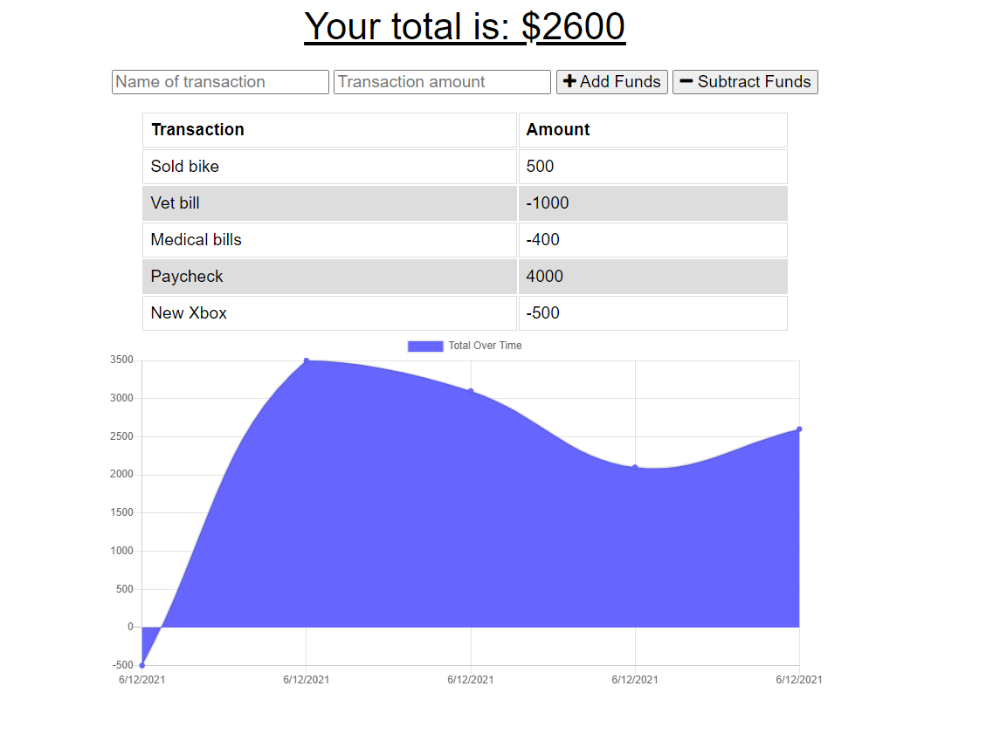

# Budget Tracker

## Description

Do you want to get in better financial shape?

This budget tracker will allow you to log your finances into a handy app that you can take with you anywhere, even if you don't have internet access. All you need to do is visit the app and log your deposits or purchases with the click of a button, then you'll see the chart of how much money you currently have. If you use the application offline, when you once again have internet, you'll be able to see the changes online, too.

Get ready to excel at budgeting!

This budget tracker was written in JavaScript using Express.js, Mongoose, Node.js, IndexedDB, MongoDB Atlas, Service Worker API, HTML, and CSS. It's deployed on Heroku.

## Table of Contents

* [Description](#description)
* [Installation](#installation)
* [Usage](#usage)
* [Credits](#credits)
* [License](#license)

## Installation

To install the application's dependencies, type the following:
```md
npm install
```
To run the server, type the following:
```md
npm start
```
Once those steps are done, you can view the application in your browser using localhost:3002.

## Usage

Navigate to [Soma Mäkelä's Budget Tracker](https://cryptic-tor-06103.herokuapp.com/) and view the web page.

* Once you're there, enter deposits or purchases whether you're online or offline.
* View chart to see how much money you have.
* Continue to add entries.



## Credits

Created by [Soma Mäkelä](https://github.com/smakela13).

## License

This website currently has No License, which means it is under exclusive copyright. No one can copy, distribute, or modify this website without permission.